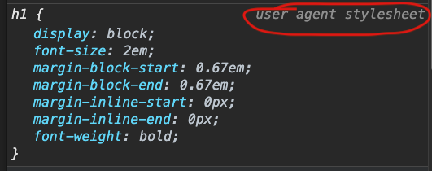

# The Display Property
As we know by now, each element on our web page has default styles as determined by the browser. These default styles can be found using your browser's inspector. They are marked as *user agent stylesheet*.



As we write CSS, we have the option to override these default styles.

## Block-Level Elements
One such default style that we will often override is the `display` property. As we see in the screenshot, the default value of the display property of a heading element is `block`.

This means that a heading is a *block-level element* by default. A block-level element has the following characteristics:

- A block-level element always starts on a new line, and the browser automatically adds some space (a margin) before and after the element.
- A block-level element always takes up the full width available (stretches out to the left and right as far as it can).
- Some commonly used block elements are: `<h1>`, `<p>`, `<table>` and `<div>`.

In practical terms, this means that block-level elements will always stack on top of each other, they cannot be displayed side-by-side.

## Inline Elements
On the other side of the coin, we have *inline elements*. Inline elements have the following characteristics:

- An inline element does not start on a new line.
- An inline element only takes up as much width as necessary.
- Some commonly used inline elements are: `<a>`, ``, `<label>`, and `<input>`.

In practical terms, this means that inline elements will always display side-by-side with their inline siblings (if there's room).

## Inline-Block
Many times, the default behavior of block-level elements is not what we want. Block-level elements like `<div>` elements stack on top of each other. 

When our layouts require two `<div>` elements or other block-level elements to be displayed side-by-side, we have several options. One of these options is to set the element's `display` property to `inline-block`.

Compared to `display: block`, the major difference is that `display: inline-block` does not add a line-break after the element, so the element can sit next to other elements.

Let's say we have some HTML code like this:

```html
<div class="feature">
  <!-- content -->
</div>
<div class="feature">
  <!-- content -->
</div>
```

In order to display these two `<div>` elements side-by-side, we can write the following CSS:

```css
.feature {
  display: inline-block;
}
```

Note that *both* blocks must have this property setting. If we have the following HTML code (`main` and `aside` elements are block-level elements):

```html
<main>
  <!-- content -->
</main>
<aside>
  <!-- content -->
</aside>
```

Then we must set *both* elements to `display: inline-block` in order to display them side-by-side.

```css
main {
  display: inline-block;
}

aside {
  display: inline-block;
}
```

### Vertical Align
When using the `display: inline-block` setting, oftentimes the elements may be different heights. By default, these elements would be aligned vertically to the baseline, or bottom edges of their box-models. To align elements to the top edges, set the `vertical-align` property of the shorter element to `top`.


```css
main {
  display: inline-block;
}

aside {
  display: inline-block;
  vertical-align: top;
}
```