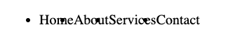

# Flexbox
Earlier, we discussed three different values for the `display` property:

1. `inline`
2. `block`
3. `inline-block`

Today, we'll talk about another possible value - `flex`. When setting an element's `display` property to `flex`, a whole new layout system becomes available. Taken as a whole, this system is known as *Flexbox*.

## Preparing for Flexbox
Implementing the Flexbox system requires some forethought. In the HTML section, we learned that each element on our page has a specific relationship to every other element (parent, child, sibling, grandchild, etc.).

Identifying and implementing these relationships is critical when using the Flexbox system.

## Flex Containers and Flex Items
Say we have some HTML code that looks like this:

```html
<ul class="menu">
  <li>Home</li>
  <li>About</li>
  <li>Services</li>
  <li>Contact</li>
</ul>
```

List items are block-level elements. That means they stack on top of each other by default.


To display these elements side-by-side, we can opt for Flexbox.

First, we must identify the parent of the items we want to position. In this example, it is the `<ul>` element.

Next, we select the element in CSS and set its `display` property to `flex`.

```css
.menu {
  display: flex;
}
```

We have now transformed the `<ul>` element into a *flex container*.

Every direct child of a flex container becomes a *flex item*. In this example, every `<li>` is now a flex item.

Flex items display side-by-side by default. Our page now renders like so:



Of course, there is some clean-up to be done. Let's write some more CSS. First, let's get rid of the default bullet points. While we're at it, let's get rid of the default space on the left as well.

```css
.menu {
  padding: 0;
  list-style-type: none;
  display: flex;
}
```


Great! Now we can work on fine-tuning our menu.

### Flex Container Properties
On the flex container, we can define the layout of each flex item on the x-axis and y-axis using two more properties:

- `justify-content` (controls the x-axis)
- `align-items` (controls the y-axis)

These properties have the same possible values:

- `space-between`
- `space-evenly`
- `space-around`
- `center`
- `flex-start`
- `flex-end`

#### The `justify-content` Property
Let's try each value on the `justify-content` property. Sometimes it's helpful to temporarily set a background color on the flex container to better understand how the flex items behave.

**`justify-content: space-between;`**
```css
.menu {
  padding: 0;
  list-style-type: none;
  background-color: aqua;
  display: flex;
  justify-content: space-between;
}
```


As we can see, `space-between` places the starting item as far to the start as possible, the ending item as far to the end as possible, and distributes the remaining space evenly amongst the other items.

**`justify-content: space-evenly;`**
```css
.menu {
  padding: 0;
  list-style-type: none;
  background-color: aqua;
  display: flex;
  justify-content: space-evenly;
}
```


The `space-evenly` setting puts an equal amount of spacing between each item.

**`justify-content: space-around;`**
```css
.menu {
  padding: 0;
  list-style-type: none;
  background-color: aqua;
  display: flex;
  justify-content: space-around;
}
```


The `space-around` setting is subtly different. The inner items are spaced evenly, but the outer spacings are half that amount.

**`justify-content: center;`**
```css
.menu {
  padding: 0;
  list-style-type: none;
  background-color: aqua;
  display: flex;
  justify-content: center;
}
```


The `center` setting places each item in the center on the x-axis.

**`justify-content: flex-start;`**
```css
.menu {
  padding: 0;
  list-style-type: none;
  background-color: aqua;
  display: flex;
  justify-content: flex-start;
}
```


The `flex-start` setting is the default setting. All items are placed at the start on the x-axis.

#### The `align-items` Property
The `align-items` property controls the items of a container on the y-axis. Let's take a look at the most important values for `align-items`. Let's also set a hard-coded height on the container to better understand how the flex items behave.

**`align-items: flex-start;`**
```css
.menu {
  padding: 0;
  list-style-type: none;
  height: 60px;
  background-color: aqua;
  display: flex;
  align-items: flex-start;
}
```


This is the default value for `align-items` if not set. All items are placed at the start of the y-axis.

**`align-items: center;`**
```css
.menu {
  padding: 0;
  list-style-type: none;
  height: 60px;
  background-color: aqua;
  display: flex;
  align-items: center;
}
```


All items are placed at the center of the y-axis.

**`align-items: flex-end;`**
```css
.menu {
  padding: 0;
  list-style-type: none;
  height: 60px;
  background-color: aqua;
  display: flex;
  align-items: flex-end;
}
```


All items are placed at the end of the y-axis.